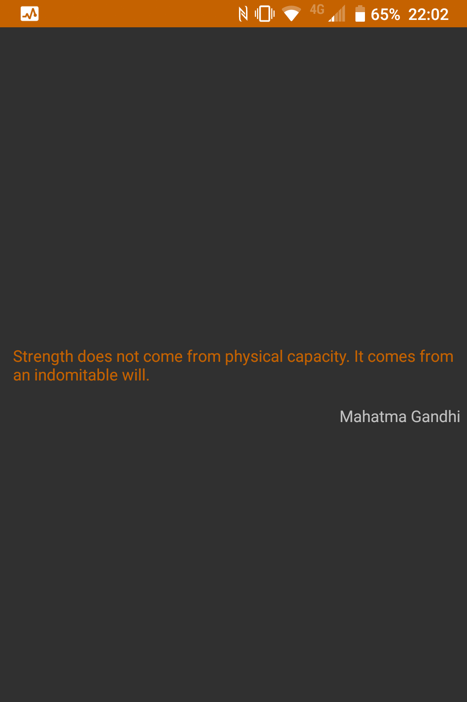
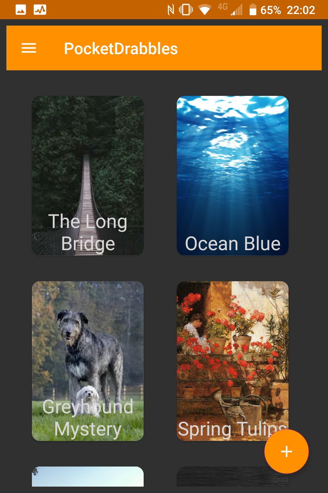
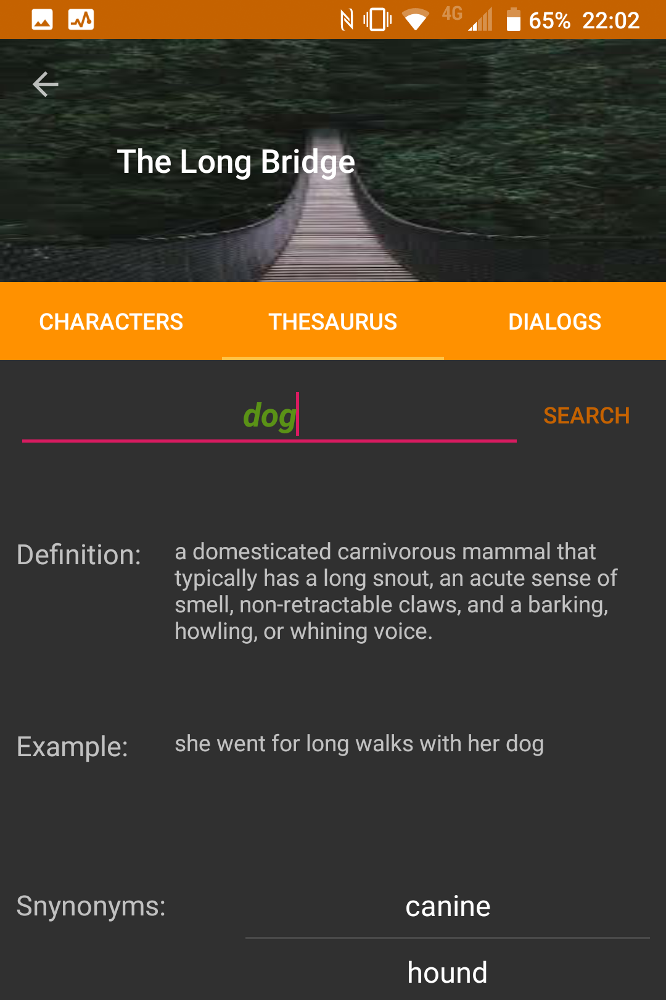
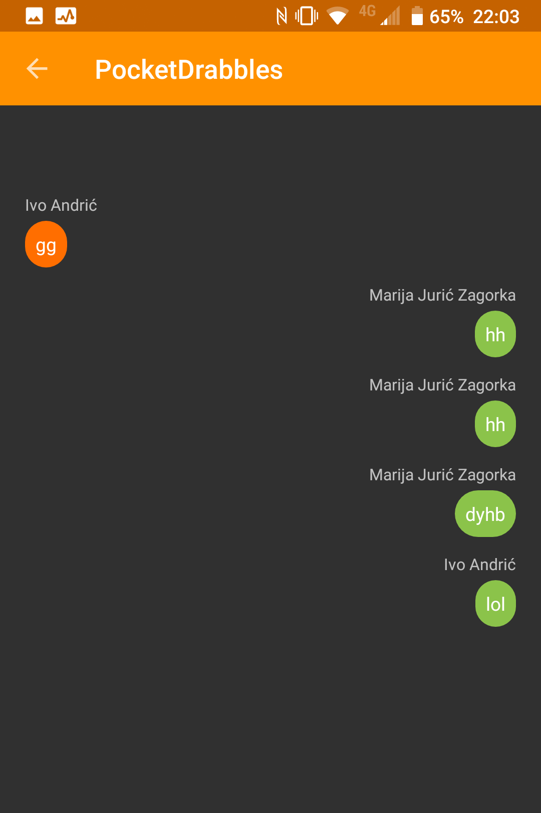

# PocketDrabbles :notebook: :pencil2:

An Android programming course project. 

Uses Firebase Realtime Database for storing data.

### Disclaimer

The author apologies for the esthetical crimes hereby commited. The colours that appear in the application can have unwanted side-effects and looking at them for a prolonged period of time may or may not lead to mild to serious bouts of cringing.

## Description

Based on an idea for creating a tool which would be of assistance to writers while they are on the move.
Since a regular pen-and-pad approach is a tad bit impractical if one is not in their home, an application is something that is always available 
seeing how carrying a smarthone around has become as understandable as carrying any organ inside one's body :woman_shrugging:
An idea for a novel, a short story or a drama may come at any moment, and jotting down a couple of lines, such as names of characters, basic traits, etc, can be
of great use in preventing the idea to evaporate back into wherever it first came from. 

## Features

- Inspiring quote of the day.
- Adding stories with cover images and short descriptions.
- Assigning characters and their descriptions to existing stories.
- Editing character info.
- Using a thesaurus to check that one word (Ok, fine - several words) whose meaning you can never really remember.
- Creating and displaying dialogs between existing characters.

## Demo

 

